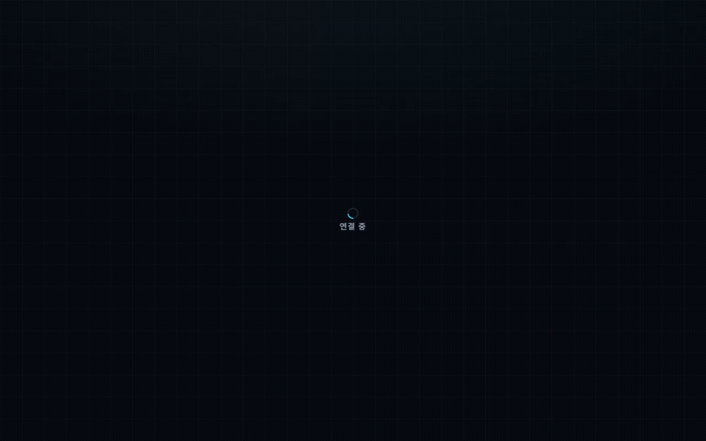
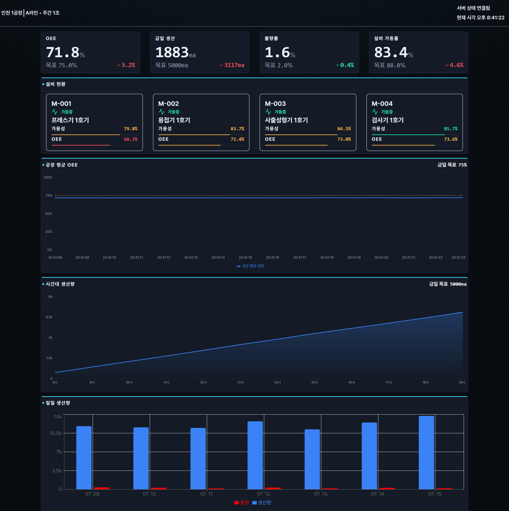
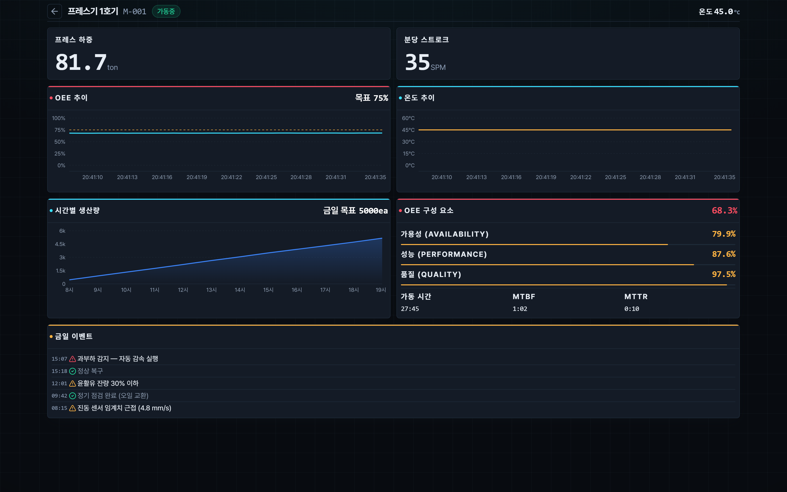

# 🏭 Factory Twin — 실시간 설비 모니터링 대시보드

> 스마트팩토리 설비의 **OEE(종합설비효율)를 실시간으로 시각화**하는 관제 대시보드.
> WebSocket으로 매초 갱신되는 설비 데이터를 받아, 공장 전체 현황부터 설비별 상세 진단까지 드릴다운합니다.



**🔗 라이브 데모:** https://pf-factory-twin.vercel.app · **💻 소스:** 이 저장소

---

## ✨ 핵심 포인트

| | |
|---|---|
| **① 실시간 스트리밍** | Node.js WebSocket 서버가 매초 4개 설비 데이터를 push, 프론트는 자동 재연결(지수 백오프)로 끊김에 대응 |
| **② 제조 도메인 지표** | OEE = 가동률 × 성능 × 품질, MTBF/MTTR 신뢰성 지표, 병목 공정(TOC) 등 현업 지표를 그대로 구현 |
| **③ 데이터 시각화** | 수치→등급→색상을 중앙화한 디자인 시스템 기반의 SCADA/HMI 톤 관제 화면 (Recharts) |

---

## 🖥️ 화면

| 전체 대시보드 (`/`) | 설비 상세 (`/machine/:id`) |
|---|---|
|  |  |

> 스크린샷/GIF는 `docs/` 폴더에 넣고 위 경로를 맞춰 주세요. (제작 방법은 아래 [데모 GIF 만들기](#-데모-gif-만들기) 참고)

---

## 🎯 주요 기능

### 전체 대시보드 (`/`)
- **KPI 카드 4종** — OEE / 금일 생산 / 불량률 / 설비 가동률, 목표 대비 갭·색상 표시
- **공장 평균 OEE 추이** — 구간(window) OEE LineChart로 실시간 변동 시각화
- **생산량 차트** — 시간별·일별 생산/불량 (서버 시드 데이터)
- **설비 목록** — 상태 아이콘 + 실시간 지표, 클릭 시 상세로 드릴다운

### 설비 상세 (`/machine/:id`)
- **OEE 3요소 분해** — 가용성(A)·성능(P)·품질(Q) ProgressBar (지표별 등급 색상)
- **설비 종류별 센서** — 프레스(하중/SPM)·용접(전류/온도)·사출(압력/금형온도)·검사(통과율)를 타입별로 다르게 표시
- **추이 차트** — OEE 추이 + 종류별 대표 지표 추이, 목표·임계 기준선(refLine)
- **신뢰성 지표** — MTBF / MTTR (고장 카운터 기반, 표본 부족 시 "측정 중")
- **금일 이벤트 로그** — 설비 종류별 이벤트 카탈로그

---

## 🛠️ 기술 스택

**Frontend** — React 19 · Vite · React Router v7 · Recharts · Tailwind CSS · Pretendard
**Backend** — Node.js · `ws` (WebSocket 서버, 설비 시뮬레이터)

---

## 🧩 아키텍처

```
┌──────────────────────────┐        wss://         ┌─────────────────────────┐
│  Frontend (React + Vite)  │  ◀───────────────────  │  Backend (Node.js + ws)  │
│                           │   매초 전체 스냅샷      │  설비 시뮬레이터          │
│  WebSocketProvider        │                        │  · 4개 설비 상태머신      │
│   └ 단일 WS 연결을         │                        │  · OEE/센서/생산 계산     │
│     Context로 전 페이지 공유│                        │  · 순차 라인(병목) 모델   │
│                           │                        │  · /health (keep-alive)   │
│  / (대시보드)             │                        └─────────────────────────┘
│  /machine/:id (상세)      │
└──────────────────────────┘
```

- **마스터–디테일 패턴** — 전체 대시보드에서 설비별 상세로 드릴다운
- **단일 WebSocket 연결** — `WebSocketProvider`가 연결 하나를 Context로 올려 모든 페이지가 공유 (중복 연결 방지)
- **서버 = 단일 진실 공급원** — 목표치(targets), 라인 정합 생산량, 병목 여부를 서버가 계산해 전송

### 서버가 매초 보내는 데이터 (요약)
```jsonc
{
  "timestamp": "2026-07-15T...",
  "machines": [
    {
      "machineId": "M-001", "name": "프레스기 1호기", "type": "PRESS",
      "status": "RUNNING", "isBottleneck": false,
      "sensor": { "load": 120.4, "spm": 58 },
      "metrics": { "runTimeSec": 0, "downCount": 0, "totalCount": 0, "defectCount": 0 },
      "targets": { "oee": 0.75, "availability": 0.88, "dailyCount": 500 }
    }
    // … 용접기 / 사출성형기 / 검사기
  ],
  "dailyProduction": [ /* 최근 7일 */ ],
  "lineHourProduction": [ /* 라인 전체 시간별 산출 */ ]
}
```

---

## 📐 도메인 지표

- **OEE (종합설비효율)** = 가용성(Availability) × 성능(Performance) × 품질(Quality)
  - 가용성 = 실가동시간 / 계획시간 · 성능 = 실제 대비 이론 생산속도 · 품질 = 양품 / 총생산
- **MTBF** (평균 고장 간격) = 가동시간 / 고장횟수 · **MTTR** (평균 수리 시간) = 정지시간 / 고장횟수
- **병목 공정 (Theory of Constraints)** — 라인에서 가장 느린 설비(사출기)가 전체 산출을 결정 → `isBottleneck`으로 표시

---

## 💡 기술적 의사결정 (하이라이트)

- **누적 OEE → 구간(window) OEE** — 누적값은 시간이 지날수록 평탄해져 변동이 안 보임. 두 시점 metrics의 델타로 구간 OEE를 계산해 차트가 실시간으로 살아 움직이도록 함.
- **자동 재연결 + 지수 백오프** — 연결이 끊기면 300ms→최대 5s로 간격을 늘려가며 재시도(서버 회복 여유 확보), N회 초과 시 "네트워크를 확인해주세요" 안내.
- **수치→등급→색상 중앙화** — `theme/levels`에서 지표별 임계값·색을 한 곳에 정의해 KPI/ProgressBar/차트가 동일한 색 규칙을 공유 (양호/주의/위험).
- **설정 주도 설계** — 설비 종류별 센서·추이·이벤트를 `constants/`의 맵으로 정의해, 컴포넌트 수정 없이 설비 타입만 추가하면 확장.

---

## 📁 폴더 구조

```
Factory_Twin/
├─ Backend/
│  └─ server.js            # WebSocket 서버 + 설비 시뮬레이터
└─ Frontend/
   └─ src/
      ├─ pages/            # Dashboard, MachineDetail
      ├─ components/       # KpiCard, Panel, ProgressBar, charts/…
      ├─ context/          # WebSocketProvider (단일 연결 공유)
      ├─ hook/             # useWebSocket(재연결), useClock
      ├─ constants/        # 설비 타입·상태·이벤트 설정 맵
      ├─ theme/            # levels(등급 색상), chartTheme
      └─ utils/            # calculateOee, getFactoryStats, 포맷터…
```

---

## 🚀 로컬 실행

**1) 백엔드 (WebSocket 서버)**
```bash
cd Backend
npm install
npm start          # ws://localhost:8080
```

**2) 프론트엔드**
```bash
cd Frontend
npm install
npm run dev        # http://localhost:5173
```

프론트는 기본적으로 `ws://localhost:8080`에 연결합니다. 다른 주소를 쓰려면 `Frontend/.env`에
`VITE_WS_URL=ws://...` 를 지정하세요 (`.env.example` 참고).

---

## ☁️ 배포

- **Frontend → Vercel** (Root: `Frontend`, 환경변수 `VITE_WS_URL=wss://<서버주소>`)
- **Backend → Render** (Root: `Backend`, Start: `npm start`)
- `/health` 엔드포인트를 UptimeRobot 등으로 주기 핑하면 무료 티어 잠들기(spin-down) 방지

> ⚠️ 배포 시 프론트가 HTTPS로 서빙되므로 WS 주소는 반드시 **`wss://`** 여야 합니다.

---

## 📸 데모 GIF 만들기

포트폴리오 제출용 GIF는 아래 순서로 딸 수 있습니다 (Windows 기준):

1. **[ScreenToGif](https://www.screentogif.com/)** 설치 (무료, 한국어 지원)
2. 백엔드·프론트를 모두 실행하고 브라우저를 준비 (`npm run dev`)
3. ScreenToGif "녹화기"로 브라우저 대시보드 영역을 잡고 녹화
4. **담을 장면 (10~15초 권장):**
   - ① 대시보드에서 KPI 카드·OEE 추이 차트가 실시간으로 갱신되는 모습
   - ② 설비 카드 클릭 → 상세 페이지로 전환 (드릴다운)
   - ③ 상세에서 A·P·Q ProgressBar / 센서 수치가 움직이는 모습
5. 편집기에서 프레임 솎아내기(용량↓) 후 `docs/demo.gif`로 저장
6. README 상단의 `<!--  -->` 주석을 해제

> 팁: GIF는 5MB 이하로. 화질이 필요하면 MP4로도 뽑아 함께 첨부하면 좋습니다.
